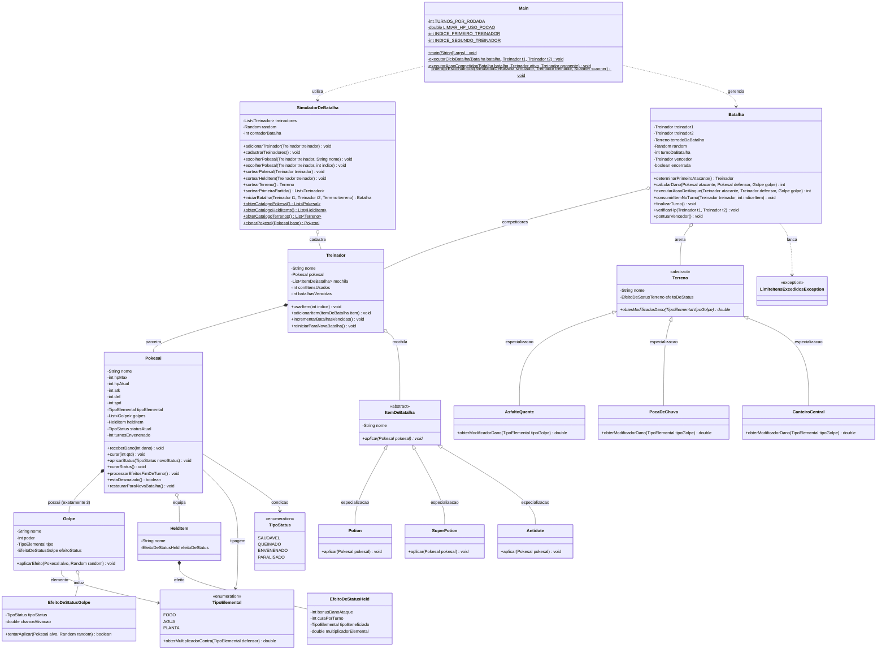

# Diagrama de Classes - PokeSal (Fases 01 e 02)

**Projeto:** PokeSal - Simulador de Batalha (UCSal Pituaçu)  
**Notação:** Mermaid Class Diagram  

```mermaid
classDiagram
    direction TB

    class Main {
        -int TURNOS_POR_RODADA$
        -double LIMIAR_HP_USO_POCAO$
        -int INDICE_PRIMEIRO_TREINADOR$
        -int INDICE_SEGUNDO_TREINADOR$
        +main(String[] args)$ void
        -executarCicloBatalha(Batalha batalha, Treinador t1, Treinador t2)$ void
        -executarAcaoCompetidor(Batalha batalha, Treinador ativo, Treinador oponente)$ void
        -interagirEscolhaInicial(SimuladorDeBatalha simulador, Treinador treinador, Scanner scanner)$ void
    }

    class SimuladorDeBatalha {
        -List~Treinador~ treinadores
        -Random random
        -int contadorBatalha
        +adicionarTreinador(Treinador treinador) void
        +cadastrarTreinadores() void
        +escolherPokesal(Treinador treinador, String nome) void
        +escolherPokesal(Treinador treinador, int indice) void
        +sortearPokesal(Treinador treinador) void
        +sortearHeldItem(Treinador treinador) void
        +sortearTerreno() Terreno
        +sortearPrimeiraPartida() List~Treinador~
        +iniciarBatalha(Treinador t1, Treinador t2, Terreno terreno) Batalha
        +obterCatalogoPokesal()$ List~Pokesal~
        +obterCatalogoHeldItems()$ List~HeldItem~
        +obterCatalogoTerrenos()$ List~Terreno~
        +clonarPokesal(Pokesal base)$ Pokesal
    }

    class Treinador {
        -String nome
        -Pokesal pokesal
        -List~ItemDeBatalha~ mochila
        -int contItensUsados
        -int batalhasVencidas
        +usarItem(int indice) void
        +adicionarItem(ItemDeBatalha item) void
        +incrementarBatalhasVencidas() void
        +reiniciarParaNovaBatalha() void
    }

    class Pokesal {
        -String nome
        -int hpMax
        -int hpAtual
        -int atk
        -int def
        -int spd
        -TipoElemental tipoElemental
        -List~Golpe~ golpes
        -HeldItem heldItem
        -TipoStatus statusAtual
        -int turnosEnvenenado
        +receberDano(int dano) void
        +curar(int qtd) void
        +aplicarStatus(TipoStatus novoStatus) void
        +curarStatus() void
        +processarEfeitosFimDeTurno() void
        +estaDesmaiado() boolean
        +restaurarParaNovaBatalha() void
    }

    class Golpe {
        -String nome
        -int poder
        -TipoElemental tipo
        -EfeitoDeStatusGolpe efeitoStatus
        +aplicarEfeito(Pokesal alvo, Random random) void
    }

    class TipoElemental {
        <<enumeration>>
        FOGO
        AGUA
        PLANTA
        +obterMultiplicadorContra(TipoElemental defensor) double
    }

    class TipoStatus {
        <<enumeration>>
        SAUDAVEL
        QUEIMADO
        ENVENENADO
        PARALISADO
    }

    class Batalha {
        -Treinador treinador1
        -Treinador treinador2
        -Terreno terredoDaBatalha
        -Random random
        -int turnoDaBatalha
        -Treinador vencedor
        -boolean encerrada
        +determinarPrimeiroAtacante() Treinador
        +calcularDano(Pokesal atacante, Pokesal defensor, Golpe golpe) int
        +executarAcaoDeAtaque(Treinador atacante, Treinador defensor, Golpe golpe) int
        +consumirItemNoTurno(Treinador treinador, int indiceItem) void
        +finalizarTurno() void
        +verificarHp(Treinador t1, Treinador t2) void
        +pontuarVencedor() void
    }

    class Terreno {
        <<abstract>>
        -String nome
        -EfeitoDeStatusTerreno efeitoDeStatus
        +obterModificadorDano(TipoElemental tipoGolpe)* double
    }

    class AsfaltoQuente {
        +obterModificadorDano(TipoElemental tipoGolpe) double
    }

    class PocaDeChuva {
        +obterModificadorDano(TipoElemental tipoGolpe) double
    }

    class CanteiroCentral {
        +obterModificadorDano(TipoElemental tipoGolpe) double
    }

    class ItemDeBatalha {
        <<abstract>>
        -String nome
        +aplicar(Pokesal pokesal)* void
    }

    class Potion {
        +aplicar(Pokesal pokesal) void
    }

    class SuperPotion {
        +aplicar(Pokesal pokesal) void
    }

    class Antidote {
        +aplicar(Pokesal pokesal) void
    }

    class HeldItem {
        -String nome
        -EfeitoDeStatusHeld efeitoDeStatus
    }

    class EfeitoDeStatusHeld {
        -int bonusDanoAtaque
        -int curaPorTurno
        -TipoElemental tipoBeneficiado
        -double multiplicadorElemental
    }

    class EfeitoDeStatusGolpe {
        -TipoStatus tipoStatus
        -double chanceAtivacao
        +tentarAplicar(Pokesal alvo, Random random) boolean
    }

    class LimiteItensExcedidosException {
        <<exception>>
    }

    Main ..> SimuladorDeBatalha : utiliza
    Main ..> Batalha : gerencia
    SimuladorDeBatalha o-- Treinador : cadastra
    Batalha o-- Treinador : competidores
    Batalha o-- Terreno : arena
    Treinador *-- Pokesal : parceiro
    Treinador o-- ItemDeBatalha : mochila
    Pokesal *-- Golpe : possui (exatamente 3)
    Pokesal o-- HeldItem : equipa
    Pokesal --> TipoElemental : tipagem
    Pokesal --> TipoStatus : condicao
    Golpe --> TipoElemental : elemento
    Golpe o-- EfeitoDeStatusGolpe : induz
    HeldItem *-- EfeitoDeStatusHeld : efeito
    Terreno <|-- AsfaltoQuente : especializacao
    Terreno <|-- PocaDeChuva : especializacao
    Terreno <|-- CanteiroCentral : especializacao
    ItemDeBatalha <|-- Potion : especializacao
    ItemDeBatalha <|-- SuperPotion : especializacao
    ItemDeBatalha <|-- Antidote : especializacao
    Batalha ..> LimiteItensExcedidosException : lanca
```
